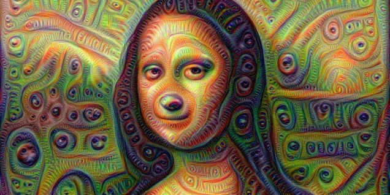
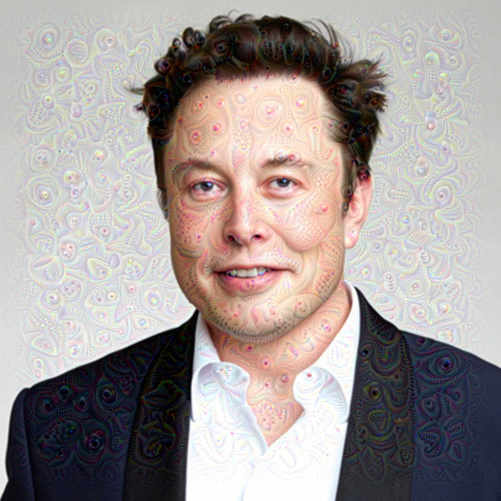
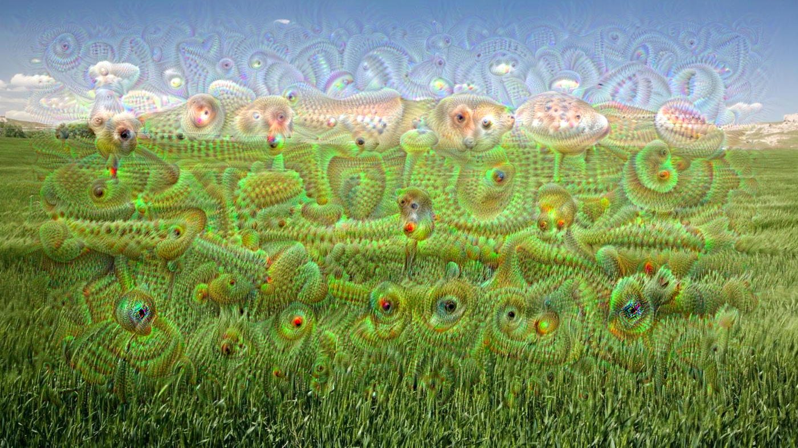
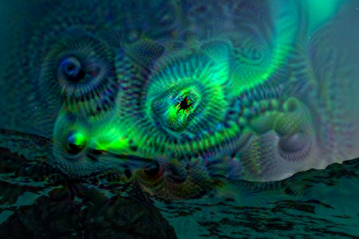

# Deep Dream by Google

The [original code](https://github.com/google/deepdream) for Google Deep Dream was written on Caffe. This is the tf.keras implementation of that code.

# Results

</img>

</img>

</img>

</img>